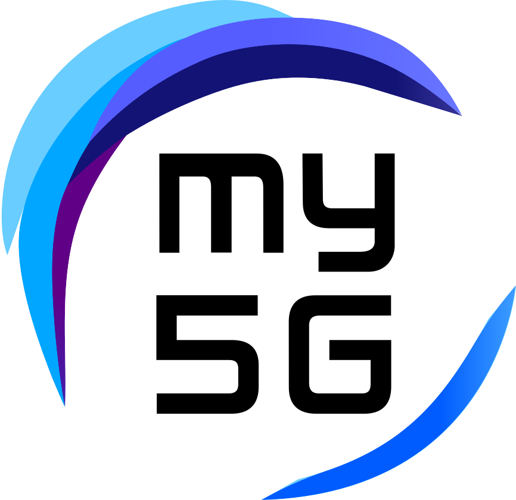

# my5G-non3GPP-IoTSDGw

<!-- TODO: replace the repo name below `template` with your repo name -->
 

 




----
<!-- TODO: add here general description of the project -->
----
## Description
LoRaWan IoT network integration project via non-3GPP access with 5G Network core

<!-- TODO: add here steps to install the project -->

----
## Installation

**Requirements**

The installation can be done directly over the host operating system (OS) or inside a virtual machine (VM). System requirements:
* CPU type: x86-64 (specific model and number of cores only affect performance)
* RAM: 4 GB
* Disk space: 40 GB
* Ubuntu 18.04 LTS

**Recommended environment**

**Steps**

Install python-minimal:
```
sudo apt update && apt install python-minimal -y
```

Install git:
```
sudo apt -y install git
```

Clone this repository:
```
git clone https://github.com/my5G/my5G-non3GPP-IoTSDGw.git
```

Install Ansible:
```
sudo apt -y install ansible
```

----
**Check**

<!-- TODO: add here steps to test the project --->

**More Information**

<!-- TODO: add here other comments that may be important (Optional) !-->

**Questions**
 
For questions, support, interacting with community members or share new ideas, use the [Discussions](../../discussions). If you want to report a bug or request a new feature, create an [issue](../../issues/new). Please, before creating a new issue, make sure it's not duplicating another existing one.

**Acknowledgments**

<!-- TODO: add here acknowledges to other projects used or external contributors -->
